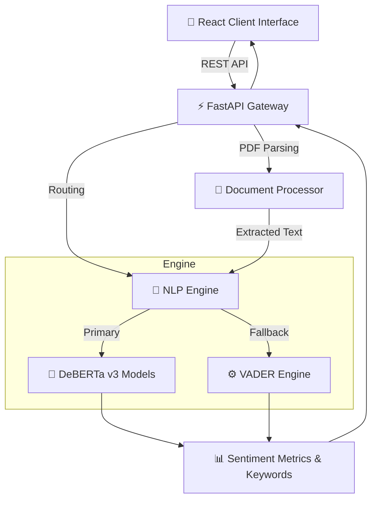

<div align="center">

# 🌟 Sentiment Studio
**Next-Generation Text & Document Sentiment Analysis Platform**

[](https://www.python.org/)
[](https://fastapi.tiangolo.com/)
[](https://react.dev/)
[](https://tailwindcss.com/)
[](https://opensource.org/licenses/MIT)

*An advanced full-stack application that transforms raw text and PDFs into actionable emotional insights using state-of-the-art NLP models.*

---

</div>

## 📖 Table of Contents
- [✨ Key Features](#-key-features)
- [🏗️ System Architecture](#️-system-architecture)
- [🛠️ Technology Stack](#️-technology-stack)
- [🚀 Getting Started](#-getting-started)
- [🌐 API Endpoints](#-api-endpoints)
- [🤝 Contributing](#-contributing)
- [📝 License](#-license)

## ✨ Key Features

- **Multi-Model Intelligence** 🧠
  - **DeBERTa Zero-Shot Classification**: Leverage Hugging Face's powerful contextual models (Small & Base) for nuanced understanding.
  - **VADER Sentiment**: Lightning-fast, rule-based fallback model for immediate results.
- **Rich & Responsive User Interface** 🎨
  - Built with React, Framer Motion, and Tailwind CSS for a premium, buttery-smooth experience.
- **Seamless Document Processing** 📄
  - Upload PDF documents and instantly extract and analyze their text sentiment.
- **Real-time Analytics Dashboard** 📊
  - Track sentiment distributions and trends over time with dynamic Recharts visualizations.
- **Robust Session Management** 🕒
  - Local session-based history tracking to keep your analysis data secure and accessible.
- **Flexible Export Capabilities** 💾
  - Download detailed sentiment reports in `.csv` or `.txt` formats for downstream use.
- **Zero Cold Starts** ⚡
  - Asynchronous background model preloading ensures instant API responses.

## 🏗️ System Architecture



## 🛠️ Technology Stack

| Layer | Technologies |
| :--- | :--- |
| **Frontend** | [TanStack Start](https://tanstack.com/start), React 19, [Tailwind CSS v4](https://tailwindcss.com/), [shadcn/ui](https://ui.shadcn.com/), [Framer Motion](https://www.framer.com/motion/), [Recharts](https://recharts.org/) |
| **Backend** | [FastAPI](https://fastapi.tiangolo.com/), Python 3.8+ |
| **Machine Learning** | Hugging Face `Transformers` (DeBERTa-v3), `vaderSentiment` |
| **Data Processing** | `pandas`, `pypdf` |

## 🚀 Getting Started

Follow these steps to get a local instance of Sentiment Studio running on your machine.

### Prerequisites
- [Node.js](https://nodejs.org/) & npm (or [Bun](https://bun.sh/))
- [Python 3.8+](https://www.python.org/)

### 1. Backend Setup

Navigate to the project root and create an isolated virtual environment:

```bash
# Create virtual environment
python -m venv .venv

# Activate it (Windows)
.venv\Scripts\activate

# Activate it (Mac/Linux)
source .venv/bin/activate

# Install core dependencies
pip install -r requirements.txt
```

### 2. Frontend Setup

Install the required JavaScript packages:

```bash
npm install
# or if using Bun
bun install
```

### 3. Running the Application

The project is designed to run the backend and frontend concurrently for an optimal development experience.

**Start the Frontend Server:**
```bash
npm run dev
```

**Start the Backend API Server:**
```bash
uvicorn app:app --host 0.0.0.0 --port 8500 --reload
```
> *Note: In a production build, the FastAPI application is also configured to serve the statically built frontend directly from the `dist/client` directory.*

## 🌐 API Endpoints

The backend exposes a robust RESTful API documented automatically via Swagger UI (accessible at `/docs` when running locally).

| Method | Endpoint | Description |
| :--- | :--- | :--- |
| `POST` | `/predict` | Analyzes JSON containing `text` and `model` (VADER, DeBERTa Small, DeBERTa Base). |
| `POST` | `/pdf/extract` | Uploads a PDF and extracts its text for immediate analysis. |
| `GET` | `/history` | Fetches the recent sentiment analysis session history. |
| `GET` | `/analytics` | Aggregates trend metrics and sentiment distributions. |
| `GET` | `/export/csv` | Downloads the current session history as a structured CSV file. |
| `GET` | `/report` | Generates a comprehensive TXT report of the latest analysis. |

## 🤝 Contributing

We welcome contributions from the community! If you'd like to improve **Sentiment Studio**, please fork the repository, make your changes, and submit a pull request. For major changes, please open an issue first to discuss what you would like to change.

## 📝 License

This project is open-source and available under the terms of the [MIT License](LICENSE).
